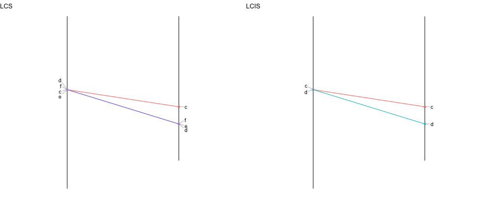

---
output:
  md_document:
    variant: markdown_github
---

LCSLCIS
--------

An R library to compute the longuest common sequences. It contains 2 functions: 

- **LCS**: Longest Common Sequence
- **LCIS**: Longest Common I Sequence

<br><br>

## Installation
The LCSLCIS library is not on CRAN yet. However you can easily install it from this github repository:
```
#install.packages("devtools")
library(devtools) 
install_github("holtzy/LCSLCIS")
library(LCSLCIS)
```


## Example
Let's consider 2 lists of elements. Each element has a specific position in each list. We can build such a dataset and represent it in the following diagram:  

```
o1 <- data.frame( 
	V1=c("g","h","c","f","e","d","m","q","r","a","b","n","o","p"), 
	V2=c(1.1,1.1,3.4,3.4,3.4,3.4,3.5,3.5,6.6,6.6,7.2,7.2,8,8)
	)
o2 <- data.frame( 
	V1=c("k","a","b","l","c","e","d","f","i","j","h","g"), 
	V2=c(0.1,1.2,1.2,4.2,4.2,5,5,5,5.3,5.3,6.7,6.7)
	)
```

The library provides a function that allows to visualize the relationship between these 2 lists.
```
show_connection(o1, o2)
```


We can now try to find the biggest set of elements without having any mismatch in their order. This can be done using the `LCS` or the `LCIS` function. Here is an example using LCS:

```
# run the LCS function
res <- LCS(o1,o2)

# The number of elements we can keep without order mismatch is 
res$LLCS

# The elements we can keep are:
res$LCS

# We can represent that on the diagram:
show_connection(o1, o2, tokeep=res$LCS)
```




## Citing

If you find LCSLCSI useful, please cite:  
in press.


## Authors

Vincent Ranwez: [homepage](https://sites.google.com/site/ranwez/)
Other:


