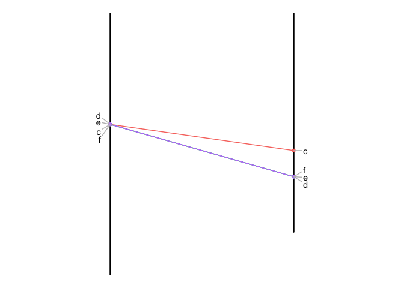

[](http://www.repostatus.org/#active) [](https://www.gnu.org/licenses/gpl-3.0.en.html)
[](https://cran.r-project.org/) [](commits/develop) [](/commits/master)

LCSLCIS
-------

An R library to compute the longuest common sequences. It contains 2 functions:

-   **LCS**: Longest Common Sequence
-   **LCIS**: Longest Common I Sequence

<br><br>

Installation
------------

The LCSLCIS library is not on CRAN yet. However you can easily install it from this github repository:

``` r
#install.packages("devtools")
library(devtools) 
```

    ## Warning: package 'devtools' was built under R version 3.4.2

``` r
install_github("holtzy/LCSLCIS")
```

    ## Downloading GitHub repo holtzy/LCSLCIS@master
    ## from URL https://api.github.com/repos/holtzy/LCSLCIS/zipball/master

    ## Installing LCSLCIS

    ## '/Library/Frameworks/R.framework/Resources/bin/R' --no-site-file  \
    ##   --no-environ --no-save --no-restore --quiet CMD INSTALL  \
    ##   '/private/var/folders/zz/zyxvpxvq6csfxvn_n0001r64000f1j/T/RtmpPlbSzk/devtools613f1bc0673a/holtzy-LCSLCIS-ab215c2'  \
    ##   --library='/Library/Frameworks/R.framework/Versions/3.4/Resources/library'  \
    ##   --install-tests

    ## 

``` r
library(LCSLCIS)
```

    ## Loading required package: tidyverse

    ## Warning: package 'tidyverse' was built under R version 3.4.2

    ## ── Attaching packages ──────────────────────────────────────────────────────────────────────────────────────────────────────────────────────────────────────────────────────────────────────────────── tidyverse 1.2.1 ──

    ## ✔ ggplot2 2.2.1.9000     ✔ purrr   0.2.4     
    ## ✔ tibble  1.4.2          ✔ dplyr   0.7.4     
    ## ✔ tidyr   0.7.2          ✔ stringr 1.3.0     
    ## ✔ readr   1.1.1          ✔ forcats 0.2.0

    ## Warning: package 'tibble' was built under R version 3.4.3

    ## Warning: package 'tidyr' was built under R version 3.4.2

    ## Warning: package 'purrr' was built under R version 3.4.2

    ## Warning: package 'dplyr' was built under R version 3.4.2

    ## Warning: package 'stringr' was built under R version 3.4.3

    ## ── Conflicts ─────────────────────────────────────────────────────────────────────────────────────────────────────────────────────────────────────────────────────────────────────────────────── tidyverse_conflicts() ──
    ## ✖ dplyr::filter() masks stats::filter()
    ## ✖ dplyr::lag()    masks stats::lag()

    ## Loading required package: ggrepel

    ## Warning: package 'ggrepel' was built under R version 3.4.2

Basic example
-------------

Let's consider 2 lists of elements. Each element has a specific position in each list. We can build such a dataset and represent it in the following diagram:

``` r
o1 <- data.frame( 
    V1=c("g","h","c","f","e","d","m","q","r","a","b","n","o","p"), 
    V2=c(1.1,1.1,3.4,3.4,3.4,3.4,3.5,3.5,6.6,6.6,7.2,7.2,8,8)
    )
o2 <- data.frame( 
    V1=c("k","a","b","l","c","e","d","f","i","j","h","g"), 
    V2=c(0.1,1.2,1.2,4.2,4.2,5,5,5,5.3,5.3,6.7,6.7)
    )
```

The library provides a function that allows to visualize the relationship between these 2 lists.

``` r
show_connection(o1, o2)
```

 

We can now try to find the biggest set of elements without having any mismatch in their order. This can be done using the `LCS` or the `LCIS` function. Here is an example using LCS:

``` r
# run the LCS function
res <- LCS(o1,o2)

# The number of elements we can keep without order mismatch is 
res$LLCS
```

    ## [1] 4

``` r
# The elements we can keep are:
res$LCS
```

    ## [1] "c" "d" "e" "f"

``` r
# We can represent that on the diagram:
show_connection(o1, o2, tokeep=res$LCS)
```




Applying to genetic maps
------------------------

The LCSLCIS library provide 2 genetic maps of wheat as toy example. Load it with:

``` r
data(geneticMap)
```

You can have a look to this 2 genetic maps doing:

``` r
head(map1)
head(map2)
```

We need to reformat this map to have an expected input: 2 columns called V1 (item name) and V2 (item position)

``` r
o1 <- map1 %>% filter(V0=="1A") %>% select(V1, V2) %>% arrange(V2)
o2 <- map2 %>% filter(V0=="1A") %>% select(V1, V2) %>% arrange(V2)
```

Let's have a look to the common items relationship:

``` r
show_connection(o1, o2, showName=FALSE)
```


Let's run LCIS to keep a subset of markers with no crossing:

``` r
res <- LCIS(o1,o2)
show_connection(o1, o2, tokeep=res$LCIS, showName=FALSE)
```


Citing
------

If you find LCSLCSI useful, please cite:
in press.

Authors
-------

Vincent Ranwez: [homepage](https://sites.google.com/site/ranwez/) Other:
