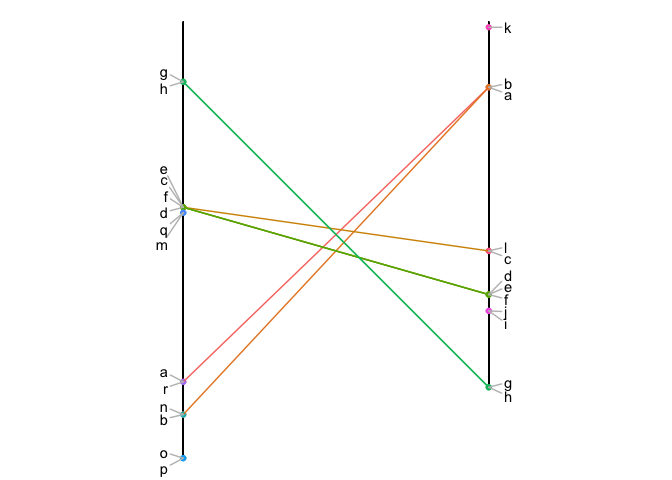
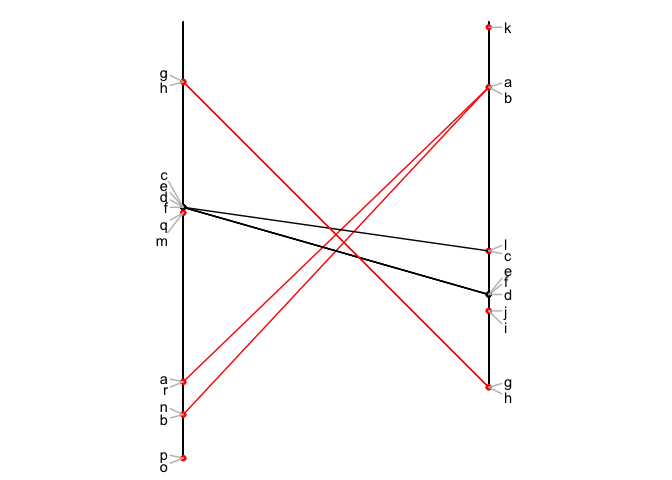
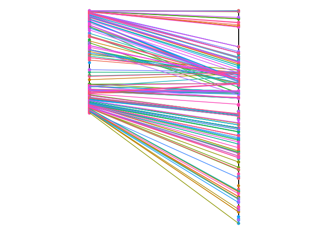
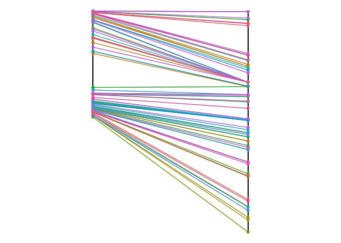
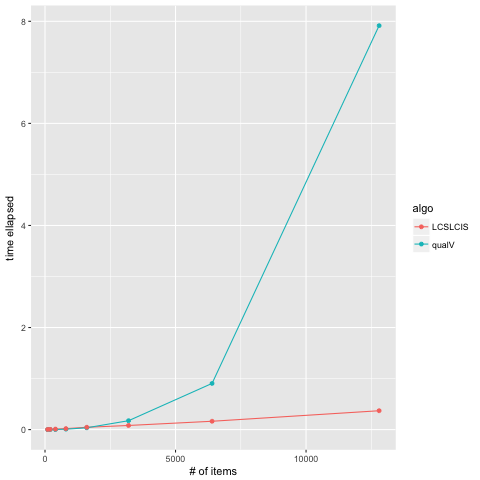

[](http://www.repostatus.org/#active) [](https://www.gnu.org/licenses/gpl-3.0.en.html)
[](https://cran.r-project.org/) [](commits/develop) [](/commits/master)

LCSLCIS
-------

An R library to compute the Longuest Common Subsequence between 2 lists of items.

<br>

Abstract
--------

Genetic maps order genetic markers along chromosomes. They are, for instance, extensively used in marker-assisted selection to accelerate breeding program. Even for the same species, people often have to deal with several alternative maps obtained using différent ordering methods or différent dataset, e.g. resulting from différent segregating populations. Having efficient tools to identify the consistency and discrepancy of alternative maps is thus essential to facilitate genetic map comparisons.
<br> We propose to encode genetic maps by bucket order, a kind of order, which takes into account the blur parts of the marker order while being an efficient data structure to achieve low complexity algorithms. We identify the **Longest Common Subsequences** of bucket orders to produce a strict consensus genetic map. The main result of this paper is an O(nlog(n)) procedure to identify the largest agreements between two bucket orders of n elements, hence providing an efficient solution to highlight discrepancies between two genetic maps.

<br>

Installation
------------

The LCSLCIS library is not on CRAN. However you can install it from this github repository:

``` r
library(devtools) 
install_github("holtzy/LCSLCIS")
library(LCSLCIS)
```

<br>

Basic example
-------------

We represent marker order along a chromosome by two lists, the first list provides the marker names and the second their position along the chromosome. Let’s consider two marker orders o1 and o2

``` r
o1 <- data.frame( 
    V1=c("g","h","c","f","e","d","m","q","r","a","b","n","o","p"), 
    V2=c(1.1,1.1,3.4,3.4,3.4,3.4,3.5,3.5,6.6,6.6,7.2,7.2,8,8)
    )
o2 <- data.frame( 
    V1=c("k","a","b","l","c","e","d","f","i","j","h","g"), 
    V2=c(0.1,1.2,1.2,4.2,4.2,5,5,5,5.3,5.3,6.7,6.7)
    )
```

The LCSLCIS package provides a `show_connection` function that allows to visualize the relationship between these 2 lists:

``` r
library(tidyverse)
library(ggrepel)
show_connection(o1, o2)
```



We can find the Longest Common Subsequences (LCS) of bucket orders to produce a strict consensus list. This is done running the `LCS` function of the package:

``` r
res <- LCS(o1,o2)
```

The `LCS` function returns a list. Several outputs are of interest:

-   `res$LLCS` is the length of the returned LCS

``` r
res$LLCS
```

    ## [1] 4

-   `res$LCS` provides the items of the LCS:

``` r
res$LCS
```

    ## [1] "c" "d" "e" "f"

-   It is straigth forward to plot only the items of the LCS:

``` r
show_connection(o1, o2, tokeep=res$LCS)
```


-   You can also draw items that are part of the LCS in grey, and other in red:

``` r
show_connection(o1, o2, highlight =res$LCS)
```



<br>

Applying to genetic maps
------------------------

The LCSLCIS library provides 2 genetic maps of wheat (format chromosome, marker name, position) as toy example. Load THEM using:

``` r
data(geneticMap)
```

You can have a look to this 2 genetic maps doing:

``` r
head(map1)
head(map2)
```

We need to reformat these maps to have a valid input for LCSLCIS: 2 columns called V1 (item name) and V2 (item position)

``` r
o1 <- map1 %>% filter(V0=="1A") %>% select(V1, V2) %>% arrange(V2)
o2 <- map2 %>% filter(V0=="1A") %>% select(V1, V2) %>% arrange(V2)
```

Let's have a look to the common items relationship:

``` r
show_connection(o1, o2, showName=FALSE)
```



Let's run LCIS to keep THE LARGEST subset of markers with no discrepencies:

``` r
res <- LCIS(o1,o2)
show_connection(o1, o2, tokeep=res$LCIS, showName=FALSE)
```



<br>

A note on speed
---------------

We compared the LCSLCSI packages with the LCS function of the [qualV package](https://github.com/cran/qualV/blob/master/R/LCS.R) that performs a similar job. Computation time was compared for several list lengths ([see script](https://github.com/holtzy/LCSLCIS/blob/master/speed_test/comparing_speed.R)). LCSLCSI is faster than qualV as described on the chart below:



Citing
------

If you find LCSLCSI useful, please cite:
*Longest Common Subsequence of Bucket Order: Application to Genetic Map Comparison (Submitted)*

<br>

Authors
-------

Lisa De Mattéo: [linkedin](https://www.linkedin.com/in/lisadematteo/)
<br> Vincent Ranwez: [homepage](https://sites.google.com/site/ranwez/) | <vincent.ranwez@supagro.fr> | corresponding author
<br> Sèverine Bérard: [homepage](http://www.pages-perso-severine-berard.univ-montp2.fr) | <Severine.Berard@umontpellier.fr>
