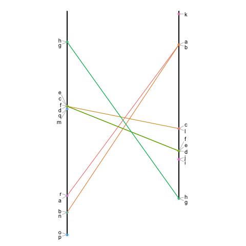

LCSLCIS
--------

An R library to compute the longuest common sequences. It contains 2 functions: 

- **LCS**
- **LCIS**

## Installation
The LCSLCIS library is not on CRAN yet. However you can easily install it from this github repository:
```
#install.packages("devtools")
library(devtools) 
install_github("holtzy/LCSLCIS")
```


## Example
Let's consider 2 list of elements. Each element has a specific position in each list. We can represent this situation in the following diagram:



## Authors

bla
